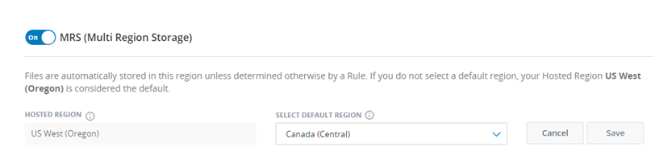
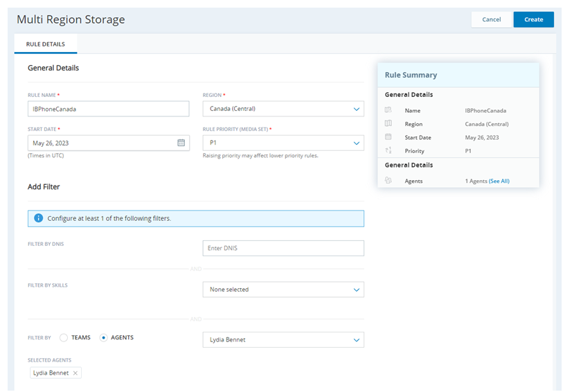
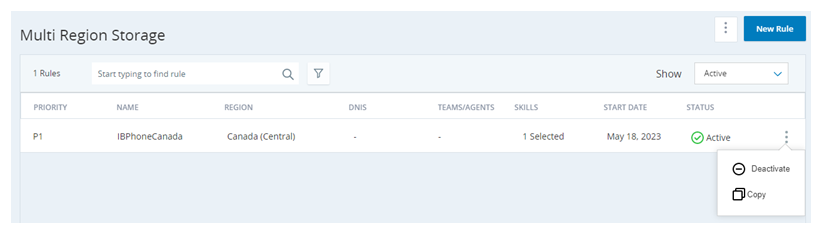

# Configure Multi-Region Storage
**Important**: This page is for Cloud Storage in AWS. If you use Cloud Storage Cloud Storage in Azure, see the Azure storage section of the Cloud Storage Services online help.

Multi-region storage requires a special license to use. Contact your Account Representative to enable it for you. Multi-region storage is mutually exclusive with both custom storage and custom AWS KMS keys.

## Enable Multi-Region Storage

1. Click the app selector  and select **Admin**.
2. Click **Cloud Storage** > **Storage Settings**.
3. Scroll down to **MRS (Multi Region Storage)** and turn it ***On***.
4. Use the **Select Default Region** drop-down to specify where to store files when they don't match any multi-region storage rules.
5. Click **Save**.

## Create Multi-Region Storage Rules

Before you begin creating your multi-region storage rules, carefully plan how you want the rules to work. Once files have been saved to a region, you cannot transfer them to another region. As you plan your multi-region storage rules, remember that: 

- You can filter by the ACD skills that generated the file and by the teams or agents that generated the file.
    **Tip**: If you create and assign the ACD skills or teams for your environment based on region, you can keep the filter simple. Otherwise, plan to create rules that individually specify all agents in the chosen region.
- Rules are type-agnostic. Files of any type will be stored in the chosen reason if they match the rule criteria. To work around this, use the filter to select only ACD skills with the preferred media type.
- You assign a priority level to a rule when you create or edit it. When a file is ready to be stored, rules are checked against the file in order of priority. If the file doesn't match any of the active rules, it's stored in the default region.
- You can have up to 10 active multi-region storage rules at a time.

1. Click the app selector  and select **Admin**.
2. Click **Cloud Storage** > **Multi Region Storage**.
3. Create a new rule using one of these methods: 
    - Using a blank form. To do this, click New Rule.
    - Copying an existing rule and modifying it. To do this, locate the rule you want to copy, click the Options An icon of three dots stacked on top of each other. icon, and click Copy.
    - If you can't find the rule you want to copy, click the Show drop-down above the table and select All. If you have many rules, you can shorten the list by using the search bar. You can also click the Filter An icon of a funnel icon and select the region associated with the rule you want to copy.
    
    DNIS appears in the product as an option but is not currently functional.
4. Fill in the required fields: 
    1. Enter a unique **Rule Name**.
    2. Select the **Region** where you want files that match the rule criteria to be stored. Only the physical file is stored in the chosen region. The metadata for all files is stored in the hosted region.
    3. Specify a **Start Date** for the rule to begin taking effect.
    4. Select the **Rule Priority** you want this rule to have. This sets the order in which CXone Mpower runs the rules attempt to match against the files, with highest priority rule running first.
5. Configure or adjust the filter criteria for the rule. These are the properties the rule requires for a file to be stored in the chosen region. Use at least one of the following fields: 
     - **Filter by Skills**: Select the ACD skills associated with the files you want to store in the chosen region.
      - **Filter by Teams** or **Filter by Agents**: Use the radio buttons to choose whether you want to filter by the ***Teams*** or ***Agents***. Use the drop-down to select the teams or agents associated with the files you want to store in the chosen region.
      
      **Important**: DNIS appears in the product as an option but is not currently functional.
6. Click **Create**.
7. Repeat the preceding steps to create more rules. You may have up to 10 active rules.​

## Deactivate a Multi-Region Storage Rule

You can have up to 10 active multi-region storage rules. If you already have 10 and you want to add a new one, you must deactivate one of your rules. If you decide to disable the multi-region storage feature altogether, you must deactivate all your rules.

1. Click the app selector  and select **Admin**.
2. Click **Cloud Storage** > **Multi Region Storage**.
3. Locate the rule you want to deactivate, click the Options  icon, and click **Deactivate**.
4. Click **Yes** in the confirmation window.​

## Reactivate a Multi-Region Storage Rule

You cannot reactivate a deactivated multi-region storage rule. Instead, you can create a new one with the same settings. To do so, create a new multi-region storage rule by copying the inactive rule and giving it a new name.

## Access Files in Multi-Region Storage

You can access your files the same way you would in a single-region environment: 
- When you retrieve files from long-term storage, CXone Mpower pulls files in all regions.
- You can use Secure External Access (SEA) with multi-region storage, but you must create a separate SEA bucket for each region.

If you're using SEA, you can find the URL for each of your file locations by going to **Admin** > **Cloud Storage** > **Storage Settings**. The URLs are listed in the Secure External Access > File Location section. Each location requires the same set of access credentials that you create on this page.

## Disable Multi-Region Storage

1. Deactivate all active multi-region storage rules.
2. Click the app selector  and select **Admin**.
3. Click **Cloud Storage** > **Storage Settings**.
4. Scroll down to **MRS (Multi Region Storage)** and turn it ***Off***.
Click **Save**.