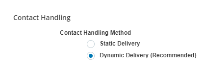

# Enable Dynamic Delivery for Your Organization

**Important**:
This page is specific to a dynamic delivery routing strategy. If your organization uses a static delivery routing strategy, you can [find this information](../staticdelivery/configureuserskillproficiency.md) in the static delivery online help.

**Required permissions**: External Business Unit Edit

**Tip**:
Switching from static delivery to dynamic delivery changes the experience for your agents. You need to train your agents on:
- Handling the extra cognitive load.
- The differences in the agent application interface. This includes manually accepting incoming contacts, if you enable that feature.

1.  Click the app selector  and select **ACD**.
2.  Go to **ACD Configuration** \> **Business Units**.
3.  Click **Edit**.
4.  In the Contact Handling section, set **Contact Handling Method** to ***Dynamic Delivery (Recommended)***.
5.  Read the verification pop-up and click **Yes**.
6.  Scroll to the top of the page and click **Done**.