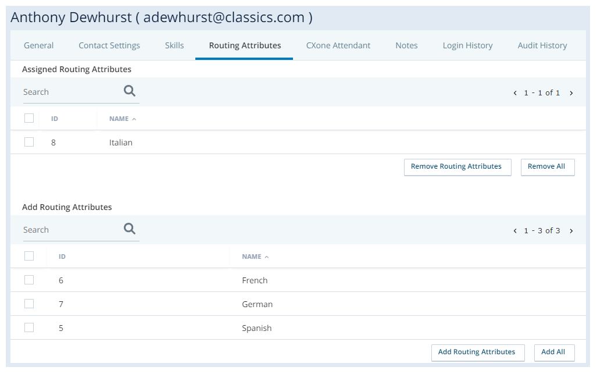
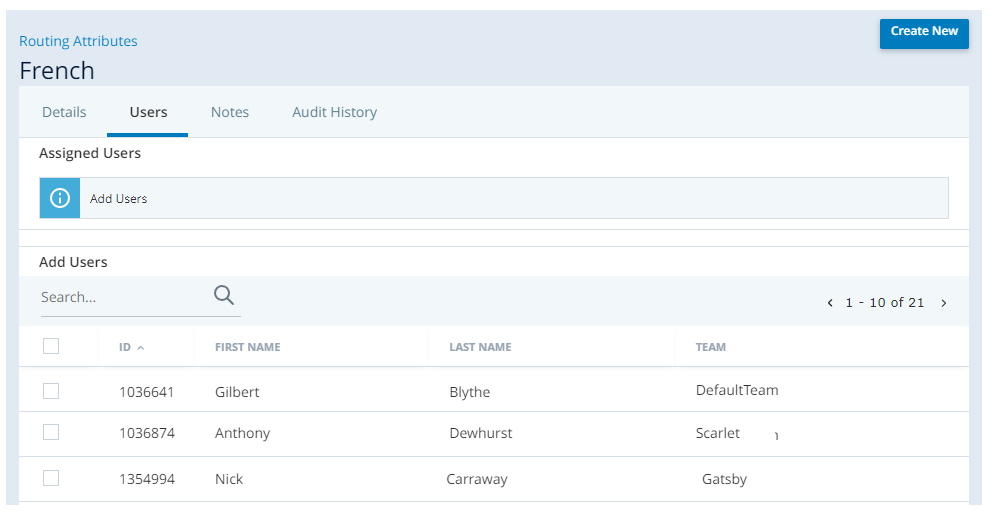

# Manage Routing Attributes

## Create Routing Attributes

**Required permissions**: Routing Attributes Create

1.  Click the app selector  and select **ACD**.
2.  Go to **Contact Settings** \> **Routing Attributes**.
3.  Click **Create New**.
4.  Enter a value in the **Routing Attribute Name** field.
5.  Click **Create Routing Attribute**.

## Assign Routing Attributes to Users

**Required permissions**: Routing Attributes User Assignment

When you create a routing attribute, you must assign it to users. You can do this from either the user account page or the routing attribute page.

### Assign Routing Attributes to User Accounts

1.  Click the app selector  and select **ACD**.
2.  Go to **ACD Users**.
3.  Click the user you want to assign routing attributes to.
4.  Click the **Routing Attributes** tab.
5.  In the Add Routing Attributes section, select the checkboxes next to the routing attributes you want to assign to the user. Click **Add Routing Attributes**.

    The selected attributes move to the **Assigned Routing Attributes** section.

### Assign Users to Routing Attributes

**Required permissions**: Routing Attributes Edit

1.  Click the app selector  and select **ACD**.
2.  Go to **Routing Attributes**.
3.  Click the routing attribute you want to assign users to.
4.  Click the **Users** tab.
5.  In the Add Users section, select the checkboxes next to the users you want to assign to the routing attribute. Click **Add Users**.

    The selected users move to the **Assigned Users** section.

## Deactivate Routing Attributes

**Required permissions**: Routing Attributes Deactivate

You can have up to 5,000 active routing attributes in your CXone Mpower system. You can deactivate routing attributes as needed to stay within the limit. You can reactivate them later if you need to. Deactivation and activation happen immediately. If you don\'t see an attribute you want to reactivate in the Routing Attributes list, make sure the **Show** field in the upper right corner is set correctly.

1.  Click the app selector  and select **ACD**.
2.  Go to **Routing Attributes**.
3.  Click the routing attribute you want to deactivate.
4.  Click **Deactivate**.

## Use a Routing Attribute

You can apply routing attributes as ACD routing criteria in the **Reqagent**, **UpdateContact**, **Queuevm**, **Queuecallback**, and **CountAgents** Studio actions. The action must still specify an ACD skill and may also specify a low and high ACD skill proficiency range for additional [bullseye routing](../bullseyerouting.md) criteria.

You must have [dynamic delivery](../dynamicdelivery/dynamicdelivery.md) enabled to assign more than one routing attribute per interaction.

These steps assume you already have your Studio routing scripts set up. If you haven\'t done that and you\'re new to Studio, see Desktop Studio Fundamentals to get started. You can also contact your Account Representative for help.

**Required permissions**: Studio Scripts Create/Edit

1.  In Studio, open the script where you want to add routing attributes.
2.  Locate the **Reqagent**, **UpdateContact**, **Queuevm**, **Queuecallback**, or **COUNTAGENTS** action where you want to add a routing attribute to the routing
    criteria.
3.  Right-click the chosen action. In the **RoutingAttribute** property, enter the attribute that agents must have to receive an interaction from this Studio action. You can enter more than one attribute, separating them with commas. **Important**: If you narrow your agent pool too far, your interactions could become stuck in queue with no matching agents to route to. To help avoid this, use no more than five attributes per routing action.
4.  Repeat the previous step to apply routing attributes to other applicable Studio actions as needed.
5.  Save the script.

    For all calls that go through the modified action, the ACD will now only route them to agents who have both the specified ACD skill and the required routing attribute.